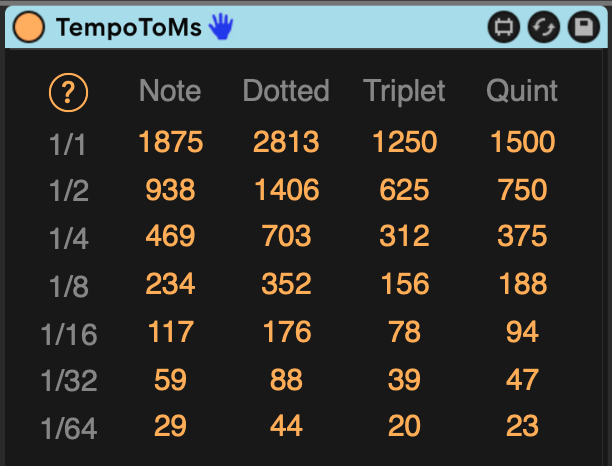

# Tempo to Ms

This is a Max For Live device that shows you the time in milliseconds for various notes at your song's current tempo.

You might use these values as a starting point for instruments or effects that are not tempo-synced.

It will always show values for the current tempo, even if you change or automate the tempo.

## Installation

[Download the newest .amxd file from the latest Release](https://github.com/zsteinkamp/m4l-TempoToMs/releases) or clone this repository, and drag the `TempoToMs.amxd` device into a track in Ableton Live.

## Changelog

* 2024-09-12 [v5](https://github.com/zsteinkamp/m4l-TempoToMs/releases/download/v5/TempoToMs-v5.amxd) - Now works as an Audio device to put in more track types. Make the UI a lot more compact.
* 2022-05-04 [0.0.4](https://github.com/zsteinkamp/m4l-TempoToMs/raw/main/frozen/TempoToMs-0.0.4.amxd) - Fix initial state bug that required the tempo to be changed once.
* 2022-04-28 [0.0.3](https://github.com/zsteinkamp/m4l-TempoToMs/raw/main/frozen/TempoToMs-0.0.3.amxd) - More color refinements; Move to vexpr for list-based calcs.
* 2022-04-27 [0.0.2](https://github.com/zsteinkamp/m4l-TempoToMs/raw/main/frozen/TempoToMs-0.0.2.amxd) - Improved fonts and colors.
* 2022-04-27 [0.0.1](https://github.com/zsteinkamp/m4l-TempoToMs/raw/main/frozen/TempoToMs-0.0.1.amxd) - Initial version.

## Usage

There is nothing to interact with or manipulate in the device. It will just show values based on the current song tempo.

## TODO

* ...

## Contributing

I'd love it if others extended this device. If you would like to contribute, simply fork this repo, make your changes, and open a pull request and I'll have a look.
